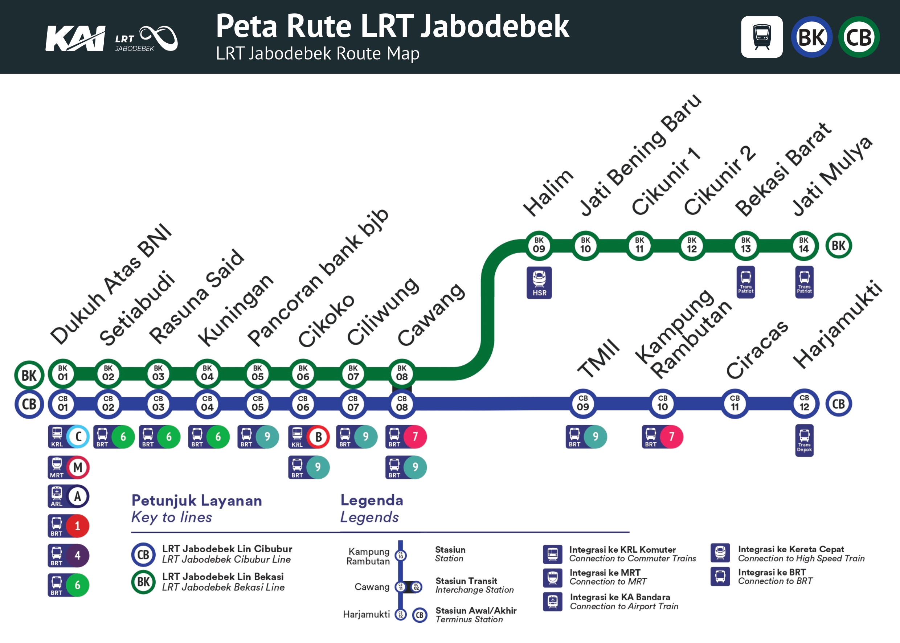
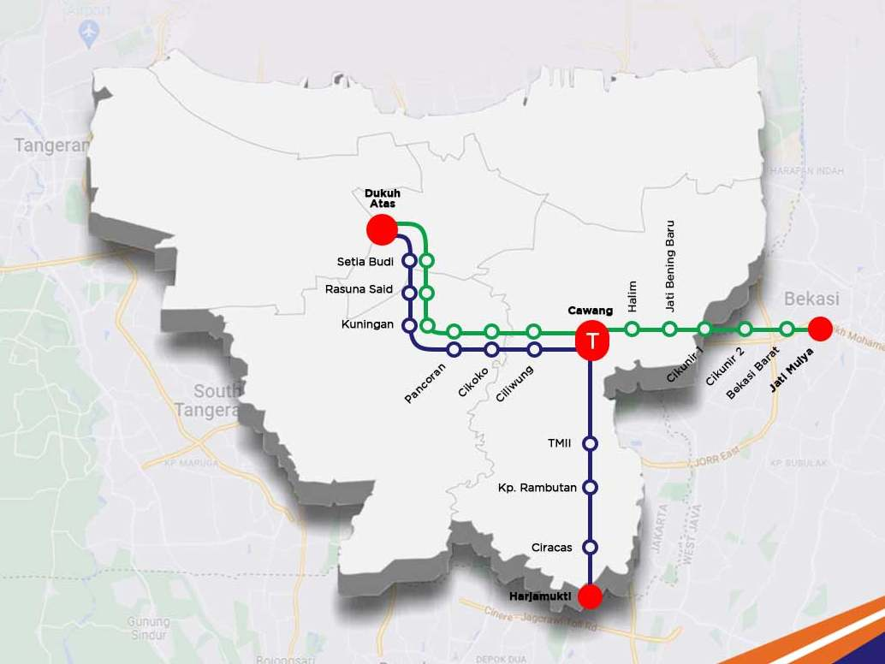
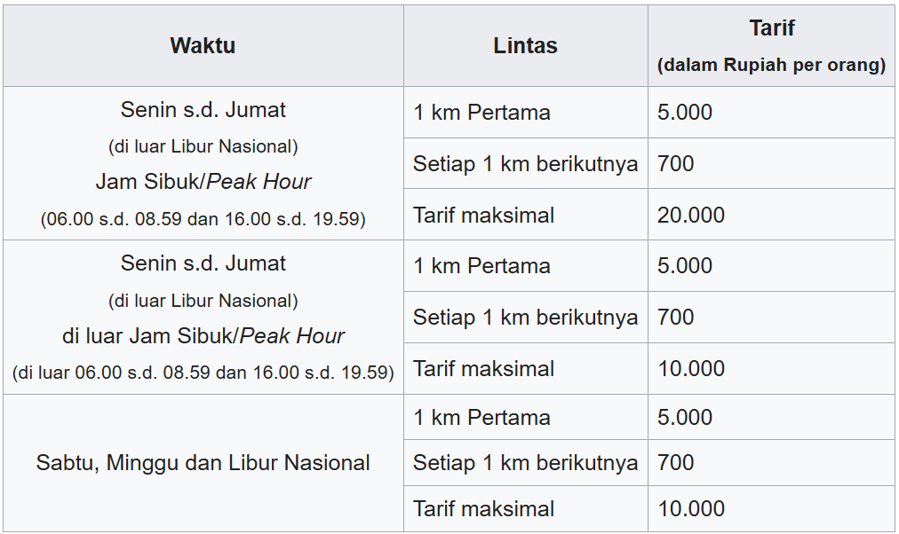
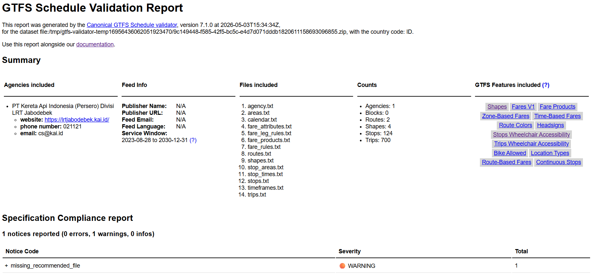

---

## Table of Contents
- [Build GTFS](#build-gtfs)
- [   Profil LRT Jabodebek Lin Bekasi dan Lin Cibubur](#---profil-lrt-jabodebek-lin-bekasi-dan-lin-cibubur)
- [Data](#data)
  - [Jadwal Keberangkatan](#jadwal-keberangkatan)
  - [Stop (Stasiun, Platform, Entrance)](#stop-stasiun-platform-entrance)
  - [Shape / Jalur](#shape--jalur)
  - [Tarif Perjalanan](#tarif-perjalanan)
- [How to Run](#how-to-run)
- [Validation GTFS](#validation-gtfs)
- [License](#license)


# Build GTFS

[**`General Transit Feed Specification (GTFS)`**](https://developers.google.com/transit/gtfs/) adalah standar format data yang digunakan untuk mendeskripsikan informasi transportasi publik seperti rute, jadwal, dan halte/stasiun dalam bentuk file teks yang terstruktur.

GTFS terdiri dari kumpulan file **CSV (Comma-Separated Values)** dengan ekstensi `.txt` yang dikompres menjadi satu file `.zip`. Setiap file memiliki skema kolom tertentu yang telah distandarisasi. GTFS terdiri dari dua Varian Utama yaitu:

- `GTFS Static`, data statis yang menggambarkan "rencana" layanan transportasi tidak berubah secara real-time. Biasanya diperbarui secara berkala (mingguan/bulanan) ketika ada perubahan jadwal atau rute.
- `GTFS Realtime`, data dinamis yang menggambarkan kondisi aktual layanan saat ini (Realtime). Menggunakan format Protocol Buffers (protobuf), diperbarui setiap beberapa detik hingga menit. Dengan GTFS-Realtime, Informasi keterlambatan, pembatalan, perubahan jadwal perjalanan dapat diketahui secara live, selain itu dapat mengetahui posisi GPS kendaraan secara real-time di peta. GTFS Realtime tidak bisa berdiri sendiri, membutuhkan GTFS Static sebagai acuan.

File GTFS dapat langsung digunakan pada routing engine seperti **OpenTripPlanner (OTP)**, **Google Maps**, atau platform transit lainnya yang mendukung format GTFS.

*Dokumentasi Resmi:* [GTFS Reference](https://gtfs.org/documentation/overview/)

---

Pada repositori ini akan dijelaskan proses *build* file GTFS pada satu  jupyter notebook (.ipnyb) yang mencakup seluruh proses pembuatan `GTFS Static` untuk operasi layanan **`LRT Jabodebek Lin Bekasi dan Lin Cibubur`**  dalam satu alur kerja yang terdokumentasi secara lengkap. Berikut ini file yang akan di-*build* pada notebook ini:

| File | Status | Deskripsi Singkat |
|------|--------|------------------|
| `agency.txt` | ✅ Required | Informasi operator (PT KAI) |
| `stops.txt` | ✅ Required | Data perihal stasiun (nama, koordinat, zona) |
| `routes.txt` | ✅ Required | Data rute/layanan (warna, tipe, referensi agency) |
| `trips.txt` | ✅ Required | Data perjalanan spesifik (route, direction) |
| `stop_times.txt` | ✅ Required | Jadwal kedatangan/keberangkatan di tiap stasiun |
| `calendar.txt` | ⚠️ Conditional | Jadwal operasional reguler (Senin-Minggu) |
| `fare_attributes.txt` | ❌ Optional | Informasi tarif/ticketing |
| `fare_rules.txt` | ❌ Optional | Aturan penerapan tarif |
| `shapes.txt` | ❌ Optional | Koordinat polyline untuk visualisasi rute di peta |

---

Setelah notebook selesai dijalankan, project ini akan memiliki struktur seperti ini:

```
gtfs_lrt_jabodebek/
├── agency.txt
├── calendar.txt
├── fare_attributes.txt
├── fare_rules.txt
├── routes.txt
├── shapes.txt
├── stops.txt
├── stop_times.txt
└── trips.txt
```


#    Profil LRT Jabodebek Lin Bekasi dan Lin Cibubur



*source: [Transport for Jakarta – Forum Diskusi Transportasi Jakarta (TFJ-FDTJ)](https://transportforjakarta.or.id/)*


---
| Profil | Detail |
|---|---|
| Jenis Layanan | Light Rapid Transit |
| Operator | PT Kereta Api Indonesia (Persero) Divisi LRT Jabodebek |
| Short Name | LRTJBDB |
| Website | https://lrtjabodebek.kai.id |
| Telepon | 121 |
| Email | cs@kai.id |
| Lin | Lin Bekasi - Lin Cibubur |
| Kode Lin | Lin Bekasi (BK) - Lin Cibubur (CB) |
| Warna Lin |      |
| Depo | Jati Mulya |
| Terminus Lin Bekasi | Stasiun Dukuh Atas Bank Syariah Indonesia [BK01] (Barat) - Stasiun Jati Mulya [BK14] (Timur)  |
| Terminus Lin Cibubur | Stasiun Dukuh Atas Bank Syariah Indonesia [CB01] (Utara) - Stasiun Harjamukti [CB12] (Selatan) |
| Jumlah Stasiun | 14 Stasiun Lin Bekasi dan 12 Stasiun Lin Cibubur |
| Panjang Jalur | ±27,8 km (Lin Bekasi) dan ±24,7 km (Lin Cibubur) |
| Karakteristik Lintas | Layang |
| Lebar Sepur | 1.435 mm |
| Jam Operasi | 05.00 – 24.00 WIB |
| Mulai Beroperasi | 28 Agustus 2023 |



*source: [Dok. KAI](https://lrtjabodebek.kai.id/informasi-peta-rute/)*

**`Daftar Stasiun`**

**`Lin Bekasi`**

<table>
  <thead>
    <tr>
      <th>No</th>
      <th>Nama Stasiun</th>
      <th>Short Name</th>
      <th>Kode Stasiun</th>
      <th>Lin</th>
    </tr>
  </thead>
  <tbody>
    <tr>
      <td>1</td>
      <td>Dukuh Atas Bank Syariah Indonesia</td>
      <td>DKA</td>
      <td>BK01</td>
      <td rowspan="14" align="center">
        <br>
        
      </td>
    </tr>
    <tr>
      <td>2</td>
      <td>Setiabudi</td>
      <td>SET</td>
      <td>BK02</td>
    </tr>
    <tr>
      <td>3</td>
      <td>Rasuna Said</td>
      <td>RAS</td>
      <td>BK03</td>
    </tr>
    <tr>
      <td>4</td>
      <td>Kuningan</td>
      <td>KUA</td>
      <td>BK04</td>
    </tr>
    <tr>
      <td>5</td>
      <td>Pancoran bank bjb</td>
      <td>PAN</td>
      <td>BK05</td>
    </tr>
    <tr>
      <td>6</td>
      <td>Cikoko</td>
      <td>CKK</td>
      <td>BK06</td>
    </tr>
    <tr>
      <td>7</td>
      <td>Ciliwung</td>
      <td>CIL</td>
      <td>BK07</td>
    </tr>
    <tr>
      <td>8</td>
      <td>Cawang</td>
      <td>CWG</td>
      <td>BK08</td>
    </tr>
    <tr>
      <td>9</td>
      <td>Halim</td>
      <td>HAL</td>
      <td>BK09</td>
    </tr>
    <tr>
      <td>10</td>
      <td>Jati Bening Baru</td>
      <td>JBU</td>
      <td>BK10</td>
    </tr>
    <tr>
      <td>11</td>
      <td>Cikunir 1</td>
      <td>CK1</td>
      <td>BK11</td>
    </tr>
    <tr>
      <td>12</td>
      <td>Cikunir 2</td>
      <td>CK2</td>
      <td>BK12</td>
    </tr>
    <tr>
      <td>13</td>
      <td>Bekasi Barat</td>
      <td>BEK</td>
      <td>BK13</td>
    </tr>
    <tr>
      <td>14</td>
      <td>Jati Mulya</td>
      <td>JTM</td>
      <td>BK14</td>
    </tr>
  </tbody>
</table>

**`Lin Cibubur`**

<table>
  <thead>
    <tr>
      <th>No</th>
      <th>Nama Stasiun</th>
      <th>Short Name</th>
      <th>Kode Stasiun</th>
      <th>Lin</th>
    </tr>
  </thead>
  <tbody>
    <tr>
      <td>1</td>
      <td>Dukuh Atas Bank Syariah Indonesia</td>
      <td>DKA</td>
      <td>CB01</td>
      <td rowspan="12" align="center">
        <br>
        
      </td>
    </tr>
    <tr>
      <td>2</td>
      <td>Setiabudi</td>
      <td>SET</td>
      <td>CB02</td>
    </tr>
    <tr>
      <td>3</td>
      <td>Rasuna Said</td>
      <td>RAS</td>
      <td>CB03</td>
    </tr>
    <tr>
      <td>4</td>
      <td>Kuningan</td>
      <td>KUA</td>
      <td>CB04</td>
    </tr>
    <tr>
      <td>5</td>
      <td>Pancoran bank bjb</td>
      <td>PAN</td>
      <td>CB05</td>
    </tr>
    <tr>
      <td>6</td>
      <td>Cikoko</td>
      <td>CKK</td>
      <td>CB06</td>
    </tr>
    <tr>
      <td>7</td>
      <td>Ciliwung</td>
      <td>CIL</td>
      <td>CB07</td>
    </tr>
    <tr>
      <td>8</td>
      <td>Cawang</td>
      <td>CWG</td>
      <td>CB08</td>
    </tr>
    <tr>
      <td>9</td>
      <td>TMII</td>
      <td>TMI</td>
      <td>CB09</td>
    </tr>
    <tr>
      <td>10</td>
      <td>Kampung Rambutan</td>
      <td>KAM</td>
      <td>CB10</td>
    </tr>
    <tr>
      <td>11</td>
      <td>Ciracas</td>
      <td>CRC</td>
      <td>CB11</td>
    </tr>
    <tr>
      <td>12</td>
      <td>Harjamukti</td>
      <td>HAR</td>
      <td>CB12</td>
    </tr>
  </tbody>
</table>


# Data

Data berikut menjadi dasar dalam membuat file GTFS LRT Jabodebek Lin Bekasi dan Lin Cibubur

## Jadwal Keberangkatan

Data jadwal keberangkatan bersumber dari [akun instagram resmi LRT Jabodebek](https://www.instagram.com/p/DUSKhaZjzpn/?igsh=ajMyZmV2N2d1ejZr) dan telah dikonversi ke format CSV dengan pengelompokan sebagai berikut:

- Berdasarkan Lin yaitu Lin Bekasi dan Lin Cibubur
- Arah perjalanan (Dukuh Atas → Jati Mulya dan sebaliknya [Lin Bekasi]) & (Dukuh Atas → Harjamukti dan sebaliknya [Lin Cibubur])
- Jenis hari operasi (Weekday / Weekend)
- Diurutkan berdasarkan waktu keberangkatan
- Setiap keberangkatan dianggap sebagai **1 trip**

Data jadwal hasil pengelompokan tersedia di [`data/jadwal-keberangkatan/`](data/jadwal-keberangkatan/).

`Weekday (Senin–Jumat)`

`Lin Bekasi`

<table>
  <thead>
    <tr>
      <th>No</th>
      <th>Asal</th>
      <th>Tujuan</th>
      <th>Jumlah Trip</th>
      <th>Lin</th>
    </tr>
  </thead>
  <tbody>
    <tr>
      <td align="center">1</td>
      <td>Dukuh Atas Bank Syariah Indonesia</td>
      <td>Jati Mulya</td>
      <td align="center">107</td>
      <td rowspan="3" align="center">
        <br>
        
      </td>
    </tr>
    <tr>
      <td align="center">2</td>
      <td>Jati Mulya</td>
      <td>Dukuh Atas Bank Syariah Indonesia</td>
      <td align="center">107</td>
    </tr>
    <tr>
      <td align="center"><strong>Total</strong></td>
      <td></td>
      <td></td>
      <td align="center"><strong>214</strong></td>
    </tr>
  </tbody>
</table>


`Lin Cibubur`

<table>
  <thead>
    <tr>
      <th>No</th>
      <th>Asal</th>
      <th>Tujuan</th>
      <th>Jumlah Trip</th>
      <th>Lin</th>
    </tr>
  </thead>
  <tbody>
    <tr>
      <td align="center">1</td>
      <td>Dukuh Atas Bank Syariah Indonesia</td>
      <td>Harjamukti</td>
      <td align="center">108</td>
      <td rowspan="3" align="center">
        <br>
        
      </td>
    </tr>
    <tr>
      <td align="center">2</td>
      <td>Harjamutkti</td>
      <td>Dukuh Atas Bank Syariah Indonesia</td>
      <td align="center">108</td>
    </tr>
    <tr>
      <td align="center"><strong>Total</strong></td>
      <td></td>
      <td></td>
      <td align="center"><strong>216</strong></td>
    </tr>
  </tbody>
</table>


`Weekend (Sabtu–Minggu)`


`Lin Bekasi`

<table>
  <thead>
    <tr>
      <th>No</th>
      <th>Asal</th>
      <th>Tujuan</th>
      <th>Jumlah Trip</th>
      <th>Lin</th>
    </tr>
  </thead>
  <tbody>
    <tr>
      <td align="center">1</td>
      <td>Dukuh Atas Bank Syariah Indonesia</td>
      <td>Jati Mulya</td>
      <td align="center">67</td>
      <td rowspan="3" align="center">
        <br>
        
      </td>
    </tr>
    <tr>
      <td align="center">2</td>
      <td>Jati Mulya</td>
      <td>Dukuh Atas Bank Syariah Indonesia</td>
      <td align="center">69</td>
    </tr>
    <tr>
      <td align="center"><strong>Total</strong></td>
      <td></td>
      <td></td>
      <td align="center"><strong>136</strong></td>
    </tr>
  </tbody>
</table>


`Lin Cibubur`

<table>
  <thead>
    <tr>
      <th>No</th>
      <th>Asal</th>
      <th>Tujuan</th>
      <th>Jumlah Trip</th>
      <th>Lin</th>
    </tr>
  </thead>
  <tbody>
    <tr>
      <td align="center">1</td>
      <td>Dukuh Atas Bank Syariah Indonesia</td>
      <td>Harjamukti</td>
      <td align="center">67</td>
      <td rowspan="3" align="center">
        <br>
        
      </td>
    </tr>
    <tr>
      <td align="center">2</td>
      <td>Harjamutkti</td>
      <td>Dukuh Atas Bank Syariah Indonesia</td>
      <td align="center">67</td>
    </tr>
    <tr>
      <td align="center"><strong>Total</strong></td>
      <td></td>
      <td></td>
      <td align="center"><strong>134</strong></td>
    </tr>
  </tbody>
</table>

Terkait dengan nama `trip_id` berikut ini format yang digunakan:

Penamaan `trip_id` terdiri dari 5 komponen yang dipisahkan tanda hubung (`-`):

```
BK/CB -  WD -  DKA  -  JTM  -  001
 │       │      │       │       │
 │       │      │       │       └── Nomor urut keberangkatan (3 digit, mulai 001)
 │       │      │       └────────── Kode stasiun tujuan
 │       │      └────────────────── Kode stasiun asal
 │       └───────────────────────── Jenis hari operasi (WD/WE)
 └──────────────────────────────── Kode Lin
```

Catatan:

* Format trip_id di atas merupakan inisiatif penyusunan sendiri untuk kebutuhan pengolahan data GTFS dan bukan standar resmi dari operator LRT Jabodebek.
* Operator LRT Jabodebek kemungkinan memiliki sistem penamaan internal tersendiri, seperti nomor perjalanan kereta (train number / nomor kereta) dengan aturan khusus yang tidak dipublikasikan secara umum.
* Oleh karena itu, trip_id dalam dataset ini bersifat custom dan digunakan semata untuk keperluan identifikasi unik tiap perjalanan dalam GTFS.


## Stop (Stasiun, Platform, Entrance)

Data ini berisi informasi seluruh titik pemberhentian dalam sistem LRT Jabodebek yang mencakup level stasiun (parent station), platform (boarding area), hingga entrance (akses masuk/keluar). Data ini digunakan untuk membangun struktur hierarki `stops.txt` dalam GTFS, memastikan keterkaitan antar elemen serta akurasi lokasi geografis setiap titik layanan penumpang. Seluruh titik koordinat (node) setiap stop diperoleh dari data `OpenStreetMap (OSM)` yang bersifat open source.

| Nama Stop | Tipe | Platform | Node OSM |
|---|---|:---:|---|
| Stasiun LRT Dukuh Atas Bank Syariah Indonesia | Parent station | — | https://www.openstreetmap.org/node/8174072570 |
| Stasiun LRT Dukuh Atas Bank Syariah Indonesia | Platform | 1 | https://www.openstreetmap.org/node/11040189499 |
| Stasiun LRT Dukuh Atas Bank Syariah Indonesia | Platform | 2 | https://www.openstreetmap.org/node/11040189500 |
| Stasiun LRT Dukuh Atas Bank Syariah Indonesia Akses A | Entrance | — | https://www.openstreetmap.org/node/13784553059 |
| Stasiun LRT Dukuh Atas Bank Syariah Indonesia Akses B | Entrance | — | https://www.openstreetmap.org/node/13784634607 |
| Stasiun LRT Dukuh Atas Bank Syariah Indonesia Akses C | Entrance | — | https://www.openstreetmap.org/node/ |
| Stasiun LRT Dukuh Atas Bank Syariah Indonesia Akses D | Entrance | — | https://www.openstreetmap.org/node/ |
| Stasiun LRT Dukuh Atas Bank Syariah Indonesia Elevator Akses A | Entrance | — | https://www.openstreetmap.org/node/13784553057 |
| Stasiun LRT Dukuh Atas Bank Syariah Indonesia Elevator Akses B | Entrance | — | https://www.openstreetmap.org/node/13784634608 |
| Stasiun LRT Setiabudi | Parent station | — | https://www.openstreetmap.org/node/6720467135 |
| Stasiun LRT Setiabudi | Platform | 1 | https://www.openstreetmap.org/node/9124369263 |
| Stasiun LRT Setiabudi | Platform | 2 | https://www.openstreetmap.org/node/9124364689 |
| Stasiun LRT Setiabudi Akses A | Entrance | — | https://www.openstreetmap.org/node/11507279415 |
| Stasiun LRT Setiabudi Akses B | Entrance | — | https://www.openstreetmap.org/node/11804907916 |
| Stasiun LRT Setiabudi Akses C | Entrance | — | https://www.openstreetmap.org/node/11507279424 |
| Stasiun LRT Setiabudi Elevator Akses A | Entrance | — | https://www.openstreetmap.org/node/13784454296 |
| Stasiun LRT Setiabudi Elevator Akses B | Entrance | — | https://www.openstreetmap.org/node/11844544368 |
| Stasiun LRT Rasuna Said | Parent station | — | https://www.openstreetmap.org/node/6720467136 |
| Stasiun LRT Rasuna Said | Platform | 1 | https://www.openstreetmap.org/node/11040189501 |
| Stasiun LRT Rasuna Said | Platform | 2 | https://www.openstreetmap.org/node/11040189502 |
| Stasiun LRT Rasuna Said Akses A | Entrance | — | https://www.openstreetmap.org/node/11516232038 |
| Stasiun LRT Rasuna Said Akses B | Entrance | — | https://www.openstreetmap.org/node/11516232036 |
| Stasiun LRT Rasuna Said Akses C1 | Entrance | — | https://www.openstreetmap.org/node/12031514934 |
| Stasiun LRT Rasuna Said Akses C2 | Entrance | — | https://www.openstreetmap.org/node/12031514936 |
| Stasiun LRT Rasuna Said Elevator Akses A | Entrance | — | https://www.openstreetmap.org/node/12031514940 |
| Stasiun LRT Rasuna Said Elevator Akses B | Entrance | — | https://www.openstreetmap.org/node/11785366792 |
| Stasiun LRT Kuningan | Parent station | — | https://www.openstreetmap.org/node/8174072567 |
| Stasiun LRT Kuningan | Platform | 1 | https://www.openstreetmap.org/node/11040189504 |
| Stasiun LRT Kuningan | Platform | 2 | https://www.openstreetmap.org/node/11040189503 |
| Stasiun LRT Kuningan Akses A | Entrance | — | https://www.openstreetmap.org/node/11529377125 |
| Stasiun LRT Kuningan Akses C1 | Entrance | — | https://www.openstreetmap.org/node/12031334773 |
| Stasiun LRT Kuningan Akses C2 | Entrance | — | https://www.openstreetmap.org/node/12031334771 |
| Stasiun LRT Kuningan Akses D | Entrance | — | https://www.openstreetmap.org/node/12031297565 |
| Stasiun LRT Kuningan Elevator Akses A | Entrance | — | https://www.openstreetmap.org/node/12031334808 |
| Stasiun LRT Kuningan Elevator Akses B | Entrance | — | https://www.openstreetmap.org/node/12031334805 |
| Stasiun LRT Pancoran bank bjb | Parent station | — | https://www.openstreetmap.org/node/6720467132 |
| Stasiun LRT Pancoran bank bjb | Platform | 1 | https://www.openstreetmap.org/node/11040204405 |
| Stasiun LRT Pancoran bank bjb | Platform | 2 | https://www.openstreetmap.org/node/11040204406 |
| Stasiun LRT Pancoran bank bjb Akses A | Entrance | — | https://www.openstreetmap.org/node/13784406397 |
| Stasiun LRT Pancoran bank bjb Akses B1 | Entrance | — | https://www.openstreetmap.org/node/12108411891 |
| Stasiun LRT Pancoran bank bjb Akses B2 | Entrance | — | https://www.openstreetmap.org/node/7098603621 |
| Stasiun LRT Pancoran bank bjb Elevator Akses A | Entrance | — | https://www.openstreetmap.org/node/13784418901 |
| Stasiun LRT Cikoko | Parent station | — | https://www.openstreetmap.org/node/6720467131 |
| Stasiun LRT Cikoko | Platform | 1 | https://www.openstreetmap.org/node/11040204408 |
| Stasiun LRT Cikoko | Platform | 2 | https://www.openstreetmap.org/node/11040204407 |
| Stasiun LRT Cikoko Akses A | Entrance | — | https://www.openstreetmap.org/node/11365102450 |
| Stasiun LRT Cikoko Akses B | Entrance | — | https://www.openstreetmap.org/node/13784386630 |
| Stasiun LRT Cikoko Elevator Akses B | Entrance | — | https://www.openstreetmap.org/node/13784353781 |
| Stasiun LRT Ciliwung | Parent station | — | https://www.openstreetmap.org/node/8487603262 |
| Stasiun LRT Ciliwung | Platform | 1 | https://www.openstreetmap.org/node/9124369397 |
| Stasiun LRT Ciliwung | Platform | 2 | https://www.openstreetmap.org/node/9124369223 |
| Stasiun LRT Ciliwung Akses A | Entrance | — | https://www.openstreetmap.org/node/5639219805 |
| Stasiun LRT Ciliwung Akses C | Entrance | — | https://www.openstreetmap.org/node/13779321273 |
| Stasiun LRT Cawang | Parent station | — | https://www.openstreetmap.org/node/12260707174 |
| Stasiun LRT Cawang | Platform | 1 | https://www.openstreetmap.org/node/11040204410 |
| Stasiun LRT Cawang | Platform | 2 | https://www.openstreetmap.org/node/11040204409 |
| Stasiun LRT Cawang | Platform | 3 | https://www.openstreetmap.org/node/11040204411 |
| Stasiun LRT Cawang | Platform | 4 | https://www.openstreetmap.org/node/11040204412 |
| Stasiun LRT Cawang Akses A1 | Entrance | — | https://www.openstreetmap.org/node/13778631933 |
| Stasiun LRT Cawang Akses A2 | Entrance | — | https://www.openstreetmap.org/node/13778713696 |
| Stasiun LRT Cawang Akses B | Entrance | — | https://www.openstreetmap.org/node/13778687810 |
| Stasiun LRT Cawang Akses C | Entrance | — | https://www.openstreetmap.org/node/13778668058 |
| Stasiun LRT Cawang Akses D | Entrance | — | https://www.openstreetmap.org/node/13778982410 |
| Stasiun LRT Cawang Akses E | Entrance | — | https://www.openstreetmap.org/node/13778676174 |
| Stasiun LRT Cawang Akses F | Entrance | — | https://www.openstreetmap.org/node/ |
| Stasiun LRT Cawang Akses G | Entrance | — | https://www.openstreetmap.org/node/13778930391 |
| Stasiun LRT Cawang Akses H | Entrance | — | https://www.openstreetmap.org/node/13778684903 |
| Stasiun LRT Cawang Akses J | Entrance | — | https://www.openstreetmap.org/node/13778684902 |
| Stasiun LRT Cawang Akses K | Entrance | — | https://www.openstreetmap.org/node/13779063111 |
| Stasiun LRT Cawang Elevator Akses H | Entrance | — | https://www.openstreetmap.org/node/13778767928 |
| Stasiun LRT Cawang Elevator Akses B | Entrance | — | https://www.openstreetmap.org/node/13779161674 |
| Stasiun LRT Halim | Parent station | — | https://www.openstreetmap.org/node/9761865798 |
| Stasiun LRT Halim | Platform | 1 | https://www.openstreetmap.org/node/11040189497 |
| Stasiun LRT Halim | Platform | 2 | https://www.openstreetmap.org/node/11040189498 |
| Stasiun LRT Halim Akses A | Entrance | — | https://www.openstreetmap.org/node/9761865809 |
| Stasiun LRT Jati Bening Baru | Parent station | — | https://www.openstreetmap.org/node/8174072566 |
| Stasiun LRT Jati Bening Baru | Platform | 1 | https://www.openstreetmap.org/node/11040189495 |
| Stasiun LRT Jati Bening Baru | Platform | 2 | https://www.openstreetmap.org/node/12578386110 |
| Stasiun LRT Jati Bening Baru Akses A | Entrance | — | https://www.openstreetmap.org/node/11743373671 |
| Stasiun LRT Jati Bening Baru Elevator Akses A | Entrance | — | https://www.openstreetmap.org/node/13778684254 |
| Stasiun LRT Cikunir 1 | Parent station | — | https://www.openstreetmap.org/node/8174072565 |
| Stasiun LRT Cikunir 1 | Platform | 1 | https://www.openstreetmap.org/node/11040189493 |
| Stasiun LRT Cikunir 1 | Platform | 2 | https://www.openstreetmap.org/node/11040189494 |
| Stasiun LRT Cikunir 1 Akses A | Entrance | — | https://www.openstreetmap.org/node/11382851957 |
| Stasiun LRT Cikunir 1 Elevator Akses A | Entrance | — | https://www.openstreetmap.org/node/13778642095 |
| Stasiun LRT Cikunir 2 | Parent station | — | https://www.openstreetmap.org/node/8174072564 |
| Stasiun LRT Cikunir 2 | Platform | 1 | https://www.openstreetmap.org/node/11040189491 |
| Stasiun LRT Cikunir 2 | Platform | 2 | https://www.openstreetmap.org/node/11040189492 |
| Stasiun LRT Cikunir 2 Akses A | Entrance | — | https://www.openstreetmap.org/node/11583698331 |
| Stasiun LRT Cikunir 2 Elevator Akses A | Entrance | — | https://www.openstreetmap.org/node/13778630202 |
| Stasiun LRT Bekasi Barat | Parent station | — | https://www.openstreetmap.org/node/8174072563 |
| Stasiun LRT Bekasi Barat | Platform | 1 | https://www.openstreetmap.org/node/4909917394 |
| Stasiun LRT Bekasi Barat | Platform | 2 | https://www.openstreetmap.org/node/4982025827 |
| Stasiun LRT Bekasi Barat Akses A | Entrance | — | https://www.openstreetmap.org/node/12264011246 |
| Stasiun LRT Bekasi Barat Akses B | Entrance | — | https://www.openstreetmap.org/node/13778592814 |
| Stasiun LRT Bekasi Barat Akses C | Entrance | — | https://www.openstreetmap.org/node/11415068296 |
| Stasiun LRT Bekasi Barat Elevator Akses A-B | Entrance | — | https://www.openstreetmap.org/node/13778592813 |
| Stasiun LRT Jati Mulya | Parent station | — | https://www.openstreetmap.org/node/7616402144 |
| Stasiun LRT Jati Mulya | Platform | 1 | https://www.openstreetmap.org/node/11040189489 |
| Stasiun LRT Jati Mulya | Platform | 2 | https://www.openstreetmap.org/node/11040189490 |
| Stasiun LRT Jati Mulya Akses A | Entrance | — | https://www.openstreetmap.org/node/13778581063 |
| Stasiun LRT Jati Mulya Akses B | Entrance | — | https://www.openstreetmap.org/node/13778581062 |
| Stasiun LRT Jati Mulya Elevator Akses A-B | Entrance | — | https://www.openstreetmap.org/node/13778581067 |
| Stasiun LRT TMII | Parent station | — | https://www.openstreetmap.org/node/4907843137 |
| Stasiun LRT TMII | Platform | 1 | https://www.openstreetmap.org/node/11040189488 |
| Stasiun LRT TMII | Platform | 2 | https://www.openstreetmap.org/node/11040189487 |
| Stasiun LRT TMII Akses A | Entrance | — | https://www.openstreetmap.org/node/13767166161 |
| Stasiun LRT Kampung Rambutan | Parent station | — | https://www.openstreetmap.org/node/6720467137 |
| Stasiun LRT Kampung Rambutan | Platform | 1 | https://www.openstreetmap.org/node/11040189486 |
| Stasiun LRT Kampung Rambutan | Platform | 2 | https://www.openstreetmap.org/node/11040189485 |
| Stasiun LRT Kampung Rambutan Akses A | Entrance | — | https://www.openstreetmap.org/node/11576541975 |
| Stasiun LRT Kampung Rambutan Elevator Akses A | Entrance | — | https://www.openstreetmap.org/node/13766839045 |
| Stasiun LRT Ciracas | Parent station | — | https://www.openstreetmap.org/node/8174072568 |
| Stasiun LRT Ciracas | Platform | 1 | https://www.openstreetmap.org/node/11040189470 |
| Stasiun LRT Ciracas | Platform | 2 | https://www.openstreetmap.org/node/12578386108 |
| Stasiun LRT Ciracas Akses A | Entrance | — | https://www.openstreetmap.org/node/11453116133 |
| Stasiun LRT Ciracas Akses B | Entrance | — | https://www.openstreetmap.org/node/11453116136 |
| Stasiun LRT Ciracas Elevator Akses A | Entrance | — | https://www.openstreetmap.org/node/11453116129 |
| Stasiun LRT Harjamukti | Parent station | — | https://www.openstreetmap.org/node/6720467138 |
| Stasiun LRT Harjamukti | Platform | 1 | https://www.openstreetmap.org/node/11040189468 |
| Stasiun LRT Harjamukti | Platform | 2 | https://www.openstreetmap.org/node/11040189467 |
| Stasiun LRT Harjamukti Akses A | Entrance | — | https://www.openstreetmap.org/node/13752213754 |
| Stasiun LRT Harjamukti Akses B | Entrance | — | https://www.openstreetmap.org/node/13752225295 |
| Stasiun LRT Harjamukti Elevator Akses B | Entrance | — | https://www.openstreetmap.org/node/13752241957 |


## Shape / Jalur

Data ini merepresentasikan geometri jalur LRT Jabodebek Lin Bekasi dan Lin Cibubur Fase 1 yang digunakan untuk membangun `shapes.txt` dalam GTFS. Data jalur diperoleh dari OpenStreetMap (OSM) dalam bentuk relation, yang menggambarkan lintasan rel secara utuh untuk setiap arah perjalanan.

`Lin Bekasi`

<table>
  <thead>
    <tr>
      <th>Jalur</th>
      <th>Relation OSM</th>
      <th>Lin</th>
    </tr>
  </thead>
  <tbody>
    <tr>
      <td>Dukuh Atas Bank Syariah Indonesia - Jati Mulya</td>
      <td align="center">
        <a href="https://www.openstreetmap.org/relation/16079479" target="_blank">
        https://www.openstreetmap.org/relation/16079479
        </a>
      </td>
      <td rowspan="2" align="center">
        <br>
        
      </td>
    </tr>
    <tr>
      <td>Jati Mulya - Dukuh Atas Bank Syariah Indonesia</td>
      <td align="center">
        <a href="https://www.openstreetmap.org/relation/16079478" target="_blank">
        https://www.openstreetmap.org/relation/16079478
        </a>
      </td>
    </tr>
  </tbody>
</table>


`Lin Cibubur`

<table>
  <thead>
    <tr>
      <th>Jalur</th>
      <th>Relation OSM</th>
      <th>Lin</th>
    </tr>
  </thead>
  <tbody>
    <tr>
      <td>Dukuh Atas Bank Syariah Indonesia - Harjamukti</td>
      <td align="center">
        <a href="https://www.openstreetmap.org/relation/16036440" target="_blank">
        https://www.openstreetmap.org/relation/16036440
        </a>
      </td>
      <td rowspan="2" align="center">
        <br>
        
      </td>
    </tr>
    <tr>
      <td>Harjamukti - Dukuh Atas Bank Syariah Indonesia</td>
      <td align="center">
        <a href="https://www.openstreetmap.org/relation/16036441" target="_blank">
        https://www.openstreetmap.org/relation/16036441
        </a>
      </td>
    </tr>
  </tbody>
</table>

Untuk memperoleh data koordinat geometri jalur LRT Jabodebek Lin Bekasi dan Lin Cibubur Fase 1 dari **OpenStreetMap (OSM)**, terdapat dua metode yang dapat digunakan, yaitu secara **online** menggunakan Overpass API atau secara **offline** melalui Overpass Turbo.

**1. Metode Online (Overpass API)**

Menggunakan Overpass API secara langsung melalui HTTP request. Disarankan menggunakan beberapa **mirror endpoint** sebagai fallback jika salah satu server tidak tersedia.

```python
OVERPASS_MIRRORS = [
    "https://overpass-api.de/api/interpreter",
    "https://overpass.kumi.systems/api/interpreter",
    "https://overpass.osm.ch/api/interpreter",
    "https://overpass.openstreetmap.ru/api/interpreter",
    "https://maps.mail.ru/osm/tools/overpass/api/interpreter",
]
```

**2. Metode Offline (Overpass Turbo)**

Menggunakan antarmuka web Overpass Turbo untuk mengekspor data dalam format GeoJSON.

Langkah-langkah:

1. Buka Overpass Turbo di: [https://overpass-turbo.eu/](https://overpass-turbo.eu/)
2. Jalankan query berikut dan sesuaikan `relation_id` dengan `relation_id` jalur tersebut:

```
[out:json][timeout:90];
relation(relation_id);
out body;
>;
out skel qt;
```

3. Klik **Export → GeoJSON**
4. Simpan file dengan nama: `relation_{relation_id}.geojson`
5. Data GeoJSON untuk jalur Lebak Bulus-Bundaran HI dan sebaliknya bisa didapatkan di [`data/shapes/`](data/shapes/)


## Tarif Perjalanan

LRT Jabodebek menerapkan tarif perjalanan berbasis jarak antar stasiun. Besaran tarif ditetapkan oleh pemerintah melalui Kementerian Perhubungan, dengan acuan terbaru pada KM 67 Tahun 2023 yang telah diperbarui melalui KM 70 Tahun 2024, dalam rangka pelaksanaan kewajiban pelayanan publik.



Informasi detail tarif perjalanan antar stasiun diperoleh dari website resmi LRT Jabodebek.

[🔗 Website resmi LRT Jabodebek](https://lrtjabodebek.kai.id/informasi-tarif) 

# How to Run

Repositori ini menyediakan satu notebook (`build_gtfs_lrt_jabodebek.ipynb`) yang menangani seluruh proses ekstraksi, transformasi, dan ekspor data menjadi file GTFS yang siap pakai.

Prerequisites:
- Python >= 3.10
- git
- Jupyter Notebook / Jupyter Lab / VS Code (dengan ekstensi Python & Jupyter)

Langkah Instalasi & Eksekusi:

1. **Clone Repository**
   ```bash
   git clone https://github.com/NafishZaldinanda/gtfs-lrt-jabodebek.git
   cd gtfs-lrt-jabodebek
   ```

2. **Siapkan virtual environment (direkomendasikan)**

3. **Install dependensi**
   ```bash
   (gtfs-lrt-jabodebek) $ pip install -r requirements.txt
   ```

4. **Jalankan Jupyter Lab**
   ```bash
   (gtfs-lrt-jabodebek) $ jupyter lab --no-browser --ip 0.0.0.0 --port 9012
   ```

5. **Akses Jupyter Lab di browser**
   ```bash
   (gtfs-lrt-jabodebek) $ http://localhost:9012
   ```

6. **Buka dan eksekusi notebook**
   - Buka file `build_gtfs_lrt_jabodebek.ipynb`
   - Di menu Jupyter, klik **Cell** → **Run All**
   - Tunggu hingga semua cell selesai dieksekusi (status `[*]` berubah menjadi `[1]`, `[2]`, dst.)
   - Pastikan tidak ada `traceback`/error di output cell terakhir

7. **Verifikasi output**
   Setelah notebook berhasil dijalankan, file GTFS akan otomatis tersimpan dalam struktur berikut:
   ```
   gtfs_lrt_jabodebek/
   ├── agency.txt
   ├── calendar.txt
   ├── fare_attributes.txt
   ├── fare_rules.txt
   ├── routes.txt
   ├── shapes.txt
   ├── stops.txt
   ├── stop_times.txt
   └── trips.txt
   ```

8. **Kompres menjadi file `.zip` siap pakai**
   ```bash
   cd gtfs_lrt_jabodebek
   zip -r ../gtfs_lrt_jabodebek.zip *.txt
   ```
   File `gtfs_lrt_jabodebek.zip` siap diunggah ke routing engine atau validator GTFS.


# Validation GTFS

Setelah file `gtfs_lrt_jabodebek.zip` berhasil dibuat, sangat direkomendasikan untuk memvalidasi file tersebut guna memastikan kompatibilitas dengan standar GTFS dan menghindari error saat diintegrasikan ke routing engine.

Berikut ini validator open-source yang direkomendasikan oleh komunitas GTFS global **[`MobilityData`](https://gtfs-validator.mobilitydata.org/)**.


Langkah-langkah:

1. Buka MobilityData gtfs-validator di: [Canonical GTFS Schedule Validator](https://gtfs-validator.mobilitydata.org/)
2. Unggah file `gtfs-lrt-jabodebek.zip`
3. Klik tombol "Choose File" atau drag-and-drop file `gtfs-lrt-jabodebek.zip` ke area yang disediakan
4. Pastikan ukuran file < 100 MB (batas upload web)
5. Klik "Validate" dan tunggu proses selesai (biasanya < 1 menit)
6. Unduh laporan (opsional), Klik "Download Report" untuk menyimpan hasil validasi dalam format JSON/HTML
7. Baca hasil validasi dengan membuka report dalam format HTML atau JSON

| Status | Arti | Tindakan
|---|---|---|
| 🟢 INFO | Saran perbaikan opsional | Boleh diabaikan jika tidak kritis |
| 🟡 WARNING | Potensi masalah kompatibilitas | Disarankan diperbaiki |
| 🔴 ERROR | Melanggar standar GTFS | Wajib diperbaiki sebelum deploy |

Berikut ini hasil validasi dari `gtfs-lrt-jabodebek.zip`:



atau 

[`GTFS Validator Report (HTML version)`](assets/report.html)

[`GTFS Validator Report (JSON version)`](assets/report.json)

`⚠️ Jika menemukan 🔴 ERROR, silakan buka issue baru`


# License

`Code`

[](LICENSE)

The code in this repository is licensed under the [MIT License](LICENSE).
You are free to use, modify, and distribute it, provided that proper attribution is included.

`Data`

| Source                                                                | Description                               | License                                                                       |
| --------------------------------------------------------------------- | ----------------------------------------- | ----------------------------------------------------------------------------- |
| [PT KAI (Persero) Divisi LRT Jabodebek](https://lrtjabodebek.kai.id/)     | Schedules, fares, and station information | © PT KAI (Persero) Divisi LRT Jabodebek                                                              |
| [OpenStreetMap](https://www.openstreetmap.org/) | Stop coordinates and route geometries     | [ODbL 1.0](https://opendatacommons.org/licenses/odbl/) |

`OpenStreetMap Attribution`

This project uses data from OpenStreetMap.

© OpenStreetMap contributors.
Data is available under the [Open Database License (ODbL) 1.0](https://opendatacommons.org/licenses/odbl/).

`Disclaimer`

This repository is created for educational and research purposes only.
It is **not an official dataset** of PT Kereta Api Indonesia (Persero) Divisi LRT Jabodebek.

* Schedule and fare data are derived from publicly available sources
* Geospatial data is derived from OpenStreetMap.